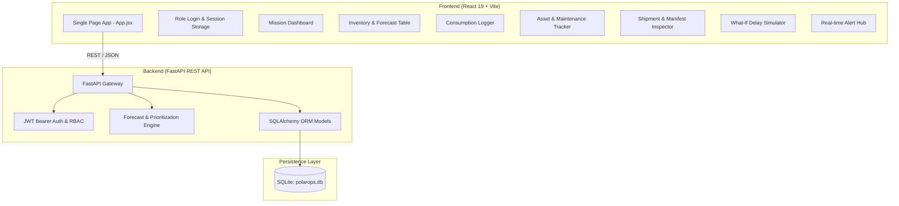

# PolarOps: Integrated Polar Expedition Logistics and Asset Management System

[](https://www.moes.gov.in/)
[](https://ncpor.res.in/)
[](#)
[](#)
[](#)

---

## 📌 Problem Statement Overview

* **Problem Statement Title**: Integrated Polar Expedition Logistics and Asset Management System
* **Description**: Develop a centralized digital platform for expedition planning, cargo tracking, inventory management, personnel movement, and emergency response.
* **Organization**: Ministry of Earth Sciences (MoES)
* **Department**: National Centre for Polar and Ocean Research (NCPOR)
* **Category**: Software
* **Theme**: Smart Automation

### Context & Polar Operational Challenges
India maintains permanent research stations in Antarctica (**Bharati**, **Maitri**) and the Arctic (**Himadri**). Operating in polar environments involves severe weather windows, isolation for 6–9 months during polar winters, and rigid maritime/aerial resupply windows (primarily via Cape Town or Tromsø). 

A single resupply delay or unpredicted resource stockout (e.g., Arctic-grade diesel, generator parts, oxygen, food) creates catastrophic life-safety and mission failure risks. **PolarOps** addresses this challenge through centralized digital logistics, predictive consumption forecasting, what-if delay impact simulation, and automated cargo prioritization.

---

## 🏗️ System Architecture & Tech Stack



### Technology Components
* **Backend**: FastAPI (Python 3.10+) with RESTful micro-endpoints, Pydantic v2 schemas, passlib + bcrypt password hashing, and python-jose JWT authentication.
* **Database & ORM**: SQLite (`polarops.db`) powered by SQLAlchemy ORM with automatic schema migrations and demo data seeding.
* **Frontend**: React 19 single-page application built on Vite, native modular CSS design system (`#0b1220` polar dark theme), and token-based state management.
* **Analytics Engine**: Deterministic statistical forecast engine calculating rolling 30-day consumption velocity, days-to-stockout, buffer margins, and multi-factor cargo prioritization scores.

---

## 🚀 Implemented Modules & Features

### 1. Authentication & Role-Based Access Control (RBAC)
* **JWT-Based Authentication**: Secure bearer tokens with 8-hour expiration.
* **Preconfigured Operational Roles**:
  * **Expedition Planner / Admin** (`admin@polarops.demo`): Global visibility, scenario simulation, master planning.
  * **Station Manager** (`station@polarops.demo`): Station inventory control, consumption auditing, emergency escalations.
  * **Logistics Officer** (`logistics@polarops.demo`): Resupply manifests, cargo prioritization, transport scheduling.
* **Quick Login Switcher**: Instant one-click credentials selector for demonstration.

### 2. Station & Expedition Monitoring
* Real-time monitoring of **Bharati Station** (Coordinates: `-69.41° S, 76.37° E`).
* Next resupply calendar tracking (default countdown window: 45 days).
* Dynamic **Station Operational Risk Level** computation: `CRITICAL` ➔ `HIGH` ➔ `MEDIUM` ➔ `LOW`.

### 3. Inventory Tracking & Consumption Logging
* **Multi-Category Cataloging**: Fuel (Diesel), Food (Rations), Medical (Kits, Oxygen Cylinders), Maintenance (Generator Spares), Communications (Radio Batteries, Satellite Modem Spares), Life Support (Water Filters), Safety (Cold Weather Gloves), and Research Equipment.
* **Consumption Logging API**:
  * Decrements stock in real-time.
  * Validates against negative stock and over-consumption.
  * Records chronological audit trail (`logged_by`, `quantity`, `logged_at`, `notes`).
  * Automatically evaluates stock vs safety buffer and triggers **High Severity Alerts** when breached.

### 4. Predictive Stockout Forecasting Engine
* Computes **Average Daily Consumption (ADC)** based on 30-day historical logs, with graceful fallback to baseline daily consumption.
* **Effective Stock calculation**:
  $$\text{Effective Stock} = \text{Current Stock} - \text{Safety Stock}$$
* **Days Remaining estimation**:
  $$\text{Days Remaining} = \frac{\text{Effective Stock}}{\text{Average Daily Consumption}}$$
* **Exact Projected Stockout Date** derivation:
  $$\text{Stockout Date} = \text{Today} + \text{Days Remaining}$$
* **Intelligent Risk Level Tagging**:
  * **Critical**: Current stock $\le$ safety stock OR remaining days $\le 7$.
  * **High**: Projected stockout date occurs *before* scheduled resupply date.
  * **Medium**: Stock buffer remains below 30 days.
  * **Low**: Stock buffer covers entire operational window.

### 5. Resupply Delay "What-If" Simulator & Cargo Prioritization
* Interactive delay slider/selector (0, 15, 30, 45, 60 days).
* Dynamically re-calculates all station stockout dates against $\text{Resupply Date} + \Delta\text{Delay}$.
* **Smart Prioritization Algorithm**:
  Calculates a composite **Priority Score** ($0 - 110+$) using:
  * **Criticality Weight**: Critical (+40), High (+30), Medium (+15), Low (+5).
  * **Risk Weight**: Critical (+40), High (+30), Medium (+15), Low (0).
  * **Safety Stock Breach**: +20 points.
  * **Vital Category Surcharge**: +10 points for *Fuel, Medical, Life Support, Communications, Maintenance*.
* **Automated Cargo Recommendations**:
  Computes precise **Recommended Resupply Quantity** to cover $((\text{Adjusted Resupply} - \text{Today}) + 14 \text{ days buffer})$ plus safety stock margin, outputting the Top 5 prioritized items.

### 6. Asset Management & Maintenance Oversight
* Tracks power systems, vehicles, comms arrays, and scientific labs (e.g., Generator G-01/G-02, Snow Vehicle SV-01, Satellite Terminal SAT-01, Lab Freezers).
* Tracks operational status: `operational`, `maintenance_due`, `degraded`, `failed`.
* Automatic overdue maintenance detection comparing `next_maintenance_date` with `today`.

### 7. Resupply Shipment Manifest Tracking
* Details vessel voyage schedules (Origin: Cape Town, Scheduled Departure, Expected Arrival, Delay Days).
* Tracks weight capacity (kg) and volume capacity ($m^3$) utilization.
* Detailed manifest itemization with individual weights, volumes, and planned counts.

### 8. Alerts & Operational Warning System
* System-wide alerts categorized by severity (`high`, `medium`, `low`).
* Entity linkage to specific items, assets, or shipments.
* Interactive "Mark as Read" functionality.

### 9. Factory Data Reset
* `POST /reset` endpoint drops and re-seeds the entire database with realistic synthetic polar data (30-day historical consumption curves, active assets, shipments, and alerts).

---

## 📊 Database Schema Summary

| Table | Purpose | Key Attributes |
|---|---|---|
| `users` | User credentials & roles | `id`, `email`, `name`, `password_hash`, `role` |
| `stations` | Station profile & resupply date | `id`, `name`, `code`, `latitude`, `longitude`, `next_resupply_date`, `status` |
| `items` | Inventory catalog & stock parameters | `id`, `station_id`, `name`, `category`, `unit`, `current_stock`, `safety_stock`, `criticality`, `default_daily_consumption`, `expiry_date` |
| `consumption_logs` | Historical resource utilization | `id`, `station_id`, `item_id`, `quantity`, `logged_at`, `logged_by`, `notes` |
| `assets` | Physical machinery & instruments | `id`, `station_id`, `name`, `category`, `status`, `location`, `serial_number`, `last_maintenance_date`, `next_maintenance_date`, `assigned_to` |
| `shipments` | Transport voyages & vessels | `id`, `station_id`, `mode`, `origin`, `status`, `scheduled_departure`, `expected_arrival`, `capacity_kg`, `capacity_volume`, `delay_days` |
| `shipment_items` | Cargo manifest details | `id`, `shipment_id`, `item_id`, `planned_quantity`, `weight_kg`, `volume_m3` |
| `alerts` | Incident & operational notifications | `id`, `station_id`, `severity`, `title`, `message`, `entity_type`, `entity_id`, `is_read`, `created_at` |

---

## 🔌 API Reference

| Method | Endpoint | Description | Auth Required |
|---|---|---|:---:|
| `GET` | `/` | API Health Check | No |
| `POST` | `/reset` | Re-seed database with synthetic polar demo data | No |
| `POST` | `/auth/login` | Authenticate user & return JWT token | No |
| `GET` | `/auth/me` | Fetch active user profile and role | Yes |
| `GET` | `/dashboard/summary` | Consolidated KPI overview for mission dashboard | No |
| `GET` | `/inventory` | List items with live consumption forecasts & risks | No |
| `POST` | `/inventory` | Register a new inventory item | No |
| `GET` | `/consumption` | Retrieve historical consumption audit trail | No |
| `POST` | `/consumption` | Log resource consumption & evaluate alerts | Optional |
| `GET` | `/assets` | List physical assets with maintenance overdue flags | No |
| `POST` | `/assets` | Register a new physical station asset | No |
| `GET` | `/shipments` | Retrieve resupply shipments & itemized manifests | No |
| `POST` | `/shipments/{id}/simulate-delay` | Inject delay days to shipment & re-evaluate | No |
| `GET` | `/forecast/inventory-risk` | Real-time inventory risk report | No |
| `GET` | `/forecast/what-if` | Resupply delay simulation & cargo prioritizer | No |
| `GET` | `/alerts` | Retrieve all active and historic alerts | No |
| `POST` | `/alerts/{id}/read` | Acknowledge alert and mark as read | No |

---

## 🎯 Alignment with NCPOR / MoES Problem Statement

| Problem Statement Pillar | Current Prototype Status | Future Production Roadmap |
|---|---|---|
| **Expedition Planning** | **Implemented**: Bharati Station profile, resupply calendar, departure/arrival schedules from Cape Town. | Multi-station support (Maitri, Himadri, IndARC), expedition phase workflows, route waypoints, satellite weather telemetry overlay. |
| **Cargo Tracking** | **Implemented**: Vessel resupply manifests, itemized volume ($m^3$) & weight (kg) capacity utilization. | Barcode/QR scanning, RFID container integration, satellite GPS transponder telemetry, cold-chain temperature sensors. |
| **Inventory Management** | **Implemented**: Full 8-category catalog, daily consumption velocity, safety stocks, days remaining, stockout date predictions. | Batch/lot expiry tracking, automated purchase requisition dispatch, inter-station resource transfer requests. |
| **Asset Management** | **Implemented**: Equipment lifecycle tracking, operating state, maintenance schedules, overdue maintenance alerts. | Predictive failure models via vibration/acoustic IoT sensors, digital work-order ticketing, spare-part BOM linking. |
| **Smart Automation** | **Implemented**: What-if delay simulator, multi-attribute cargo prioritization algorithm, dynamic stockout alerts. | MILP (Mixed Integer Linear Programming) cargo packing optimization, autonomous resupply recommendation agent. |
| **Personnel Movement** | **Partially Implemented**: User actions logged to users/operators. | Station personnel roster, field mission sorties tracker, polar survival gear check-in/out, medical clearance tracking. |
| **Emergency Response** | **Partially Implemented**: Real-time high-severity alerts for stockout breaches & asset failures. | Distress SOS coordination protocol, emergency air-drop calculator, medical evacuation (MEDEVAC) logistics workflow. |

---

## 💻 Local Installation & Setup Guide

### Prerequisites
* Python 3.10 or higher
* Node.js 18 or higher (with npm)

### 1. Backend Setup
```bash
# Navigate to backend directory
cd backend

# Create virtual environment (Windows)
python -m venv venv
venv\Scripts\activate

# Install dependencies
pip install -r requirements.txt

# Start FastAPI server
uvicorn app.main:app --reload --port 8000
```
The API documentation (Swagger UI) will be accessible at: `http://127.0.0.1:8000/docs`.

### 2. Frontend Setup
```bash
# Navigate to frontend directory in a new terminal
cd frontend

# Install dependencies
npm install

# Start Vite development server
npm run dev
```
The web dashboard will be available at: `http://localhost:5173`.

---

## 🔑 Demo Access Credentials

| Role | Email | Password | Primary Scope |
|---|---|---|---|
| **Expedition Planner / Admin** | `admin@polarops.demo` | `admin123` | Master Planning, Simulation & Analytics |
| **Station Manager** | `station@polarops.demo` | `station123` | Station Inventory, Assets & Local Alerts |
| **Logistics Officer** | `logistics@polarops.demo` | `logistics123` | Shipments, Cargo Manifests & Priority Packing |

*(Note: Fast single-click login buttons are provided on the login page).*